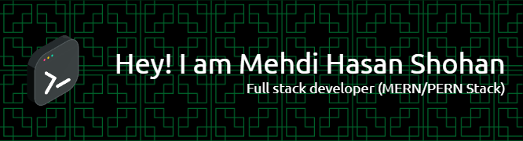

***A passionate full-stack developer specializing in MERN/PERN stack technologies. Experienced in building responsive and scalable web applications, with a keen interest in learning and implementing the latest web development trends. Enthusiastic about contributing to innovative projects and collaborating with talented teams. My technical skills include TypeScript and JavaScript for programming, MongoDB and PostgreSQL for databases, and Node.js with Express.js for backend development. On the front end, I'm proficient with React, Next.js, Redux-toolkit, and various UI libraries like Material-UI, TailwindCSS, and Ant Design. As a continuous learner, I'm always excited to explore new technologies and methodologies in the ever-evolving web development landscape. ***

### 👨🏻‍💻 &nbsp;About Me

💡 &nbsp; I like to explore new technologies and develop full-stack web applications.\
🌱 &nbsp; I'm on track to learning more about programming, software development, and MERN Stack Development.\
💬 &nbsp; Feel free to reach out to me to discuss the latest technologies and open-source Contributions.\
✉️ &nbsp; You can email me at **mehdihasanshohan25@gmail.com**, and I'll try to respond as soon as possible.\
📄 &nbsp; Please have a look at my **[Resume](https://drive.google.com/file/d/1Wf6KWfWV2fZF5iuUiyfFgTOtP4z-hV-L/view?usp=sharing)** or **[Portfolio](https://mhshohan.vercel.app/)** for more details about me. I'm open to feedback and suggestions!\
💬 &nbsp; Ask me about **TypeScript, JavaScript, Express.js, Node.js, MongoDB, PostgreSQL, React, Next.js, Redux-toolkit**\
⚡ &nbsp; Fun fact: **I Love to Play Guitar...**

  

### 🛠 &nbsp;Tech Stack

&nbsp;
&nbsp;
&nbsp;
&nbsp;
&nbsp;
&nbsp;
&nbsp;

\
&nbsp;
&nbsp;
&nbsp;
&nbsp;
&nbsp;
&nbsp;
&nbsp;
\
&nbsp;
&nbsp;
&nbsp;
&nbsp;
&nbsp;
&nbsp;

### ⚙️ &nbsp;GitHub Analytics

  

### 🤝🏻 &nbsp;Connect with Me

